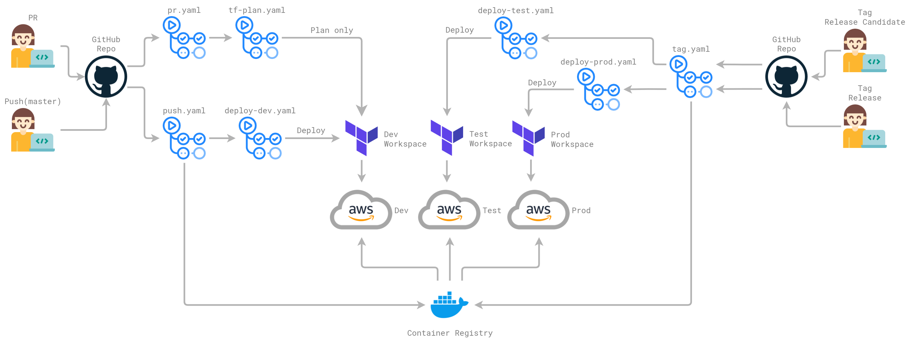

# Sample Startup Project

[](https://github.com/bcgov/repomountie/blob/master/doc/lifecycle-badges.md).

---

## Introduction


Welcome to your new project. This is a basic BC Gov AWS "Hello World" starter project to get you started in your cloud journey.  It is a NodeJS app connected to a database for you to modify and expand to fit your needs. It provides scripts for developing and running the application either

- Locally: it runs in your local machine. It will create a Docker container that will run in any OS (Mac, Linux, Windows), inside this Docker container, there will be other docker containers (Docker-in-Docker) that are the ones that will serve the application
- On the AWS Cloud. It uses Terraform/Terragrunt scripts that allow  "Infrastructure-as-Code". They allow the app to be easily deployed to any public cloud environments.
Currently, only AWS is supported, but support for other cloud targets may be added in the future.

## Build Application Locally

### Prerequisites for building locally

In order to develop or run the app locally, you will need the following:

- [Docker](https://docs.docker.com/get-docker/)
- [Microsoft Visual Studio Code](https://code.visualstudio.com/)
  - Extension: [Remote Development](https://marketplace.visualstudio.com/items?itemName=ms-vscode-remote.vscode-remote-extensionpack)

### Launch DevContainer locally, and then Build and Run Docker-in-Docker containers

1. Fork the app repository to your GitHub repository
2. Clone the repository to your local machine and open it in VS Code.
3. Using the Command Palette (Windows: `Ctrl+Shift+P` | Mac: `⇧ ⌘ P`), enter the command: `Rebuild Containers: Reopen in Container`
4. VS Code will now display the project in a `Dev Container: Docker in Docker` (look at the label at the bottom right)
5. Using the Command Palette again, enter the command `Remote Containers: Rebuild and Reopen in Containers`. It will build and launch the container defined by _./.devcontainer/DockerFile_
6. Using VS Code, you can connect to this second VS Code project (with the name _startup-sample-project-aws-containers [Dev Container]_). In this project, open a terminal session (in VS Code interface). This session is actually in the docker container. The prompt looks like:
      `vscode ➜ /workspaces/startup-sample-project-aws-containers ([branch name]  ) $`
7. Type:
    `docker-compose -f docker-compose.dev.yml build`
to build the client, server and mongo containers (inside the main container)
8. Type:
    `docker-compose -f docker-compose.dev.yml up -d`
to run the containers (inside the main container)
9. Clicking on the PORTS tab (in Terminal) You will see


Opening  the file `./client/Dockerfile.dev` we see the port 4000 is the one that exposing the client side ot the application.

10- Connect to <http://localhost:4000>, you will be able to access the application running on your local machine

### Other Useful Commands (locally, when using Docker-in-Docker)

The following commands are executed locally inside your main container: Docker in Docker

- If you want to run only one of the containers defined in docker-compose.dev.yml, then type:  
`docker-compose -f docker-compose.dev.yml up mongodb`
in this example will only run mongodb container

- Closes all the containers:
`docker-compose -f docker-compose.dev.yml down`

- Restarts the local development containers:
`docker-compose -f docker-compose.dev.yml restart`

- Tail logs from local development containers:  
`docker-compose -f docker-compose.dev.yml logs -f`

- Opens a session in the containers:
`docker exec -it $(PROJECT)-client sh`  
`docker exec -it $(PROJECT)-server sh`  
`docker exec -it $(PROJECT)-mongodb bash`  


- Runs scripts in the server container:
`docker exec -it $(PROJECT)-server npm run db:seed`  
`docker exec -it $(PROJECT)-server npm run db:migration`  
`docker exec -it $(PROJECT)-server npm test`  

Note: The above commands will work when executed from the container defined in _./devcontainer_ If you open the  _./.devcontainer/Dockerfile_ you will see that at the end of the file, these variables are set as the container environmental variables 


## Deploy Application on the AWS Cloud

### Prerequisites for building in the AWS Cloud


This code assumes that you have credentials that allow access to the AWS Cloud. These credentials will be used by the Terraform scripts to create the infrastructure in AWS. The credentials are created as part of the project set creation by the Cloud Pathfinder team.

Once the project set is created, it will have one or more service accounts associated each of them with different credentials and roles.

These credentials, necessary to access AWS Cloud, are send to Terraform cloud by the GitHub Actions. The values themselves are stored as GitHub _Secrets_


The required Secrets are:
- `AWS_ACCESS_KEY_ID` - credentials for you service account
- `AWS_SECRET_ACCESS_KEY` - credentials for you service account
- `AWS_ROLE_TO_ASSUME` - ARN of the role to assume with your credentials. Follows the pattern `arn:aws:iam::############:role/PBMMOps-BCGOV_tools_Project_Role_ecr_read_write` where `############` is your AWS account number.

- `AWS_ACCOUNTS_ECR_READ_ACCESS` - is used to authorize the read access to the ECS from the other AWS accounts (dev, test, prod). It is an array where the individual elemens take the format  follows the format `arn:aws:iam::############:root` where `############` is your AWS account number. For exmple: 

    AWS_ACCOUNTS_ECR_READ_ACCESS='["arn:aws:iam::DEV_ACCOUNT_NUMBER:root", "arn:aws:iam::TEST_ACCOUNT_NUMBER:root", "arn:aws:iam::PROD_ACCOUNT_NUMBER:root"]'

    

A more target approach is possible, it is not necessary to authorize entire accounts.

- `AWS_ECR_URI` - ECR repository URI. Follows the format `############.dkr.ecr.ca-central-1.amazonaws.com/ssp` where `############` is your AWS account number.
- `AWS_REGION` - should be `ca-central-1`
- `TFC_TEAM_TOKEN` - Terraform Cloud team token with access to Terraform workspaces used to deploy the app and infrastructure to AWS.


### Customizing the code

To install the app on the Cloud you will need access to BCGov-SEA Cloud in AWS

In the forked version of the code, you will need to:


- replace the project variable with your License Plate (line 4 of _./terraform/terragrunt.hcl_ file)
- replace the cloud_origin_domain with your license plate value (line 17 _./terraform/dev/terragrunt.hcl_ file)
- replace the project variable with your License Plate (line 8 of _./terraform/tools/terragrunt.hcl_ file)

Note: License plate is one of the access keys provided by the Cloud Pathfinder group to allow access to BCGov SEA - AWS

### Deployment

The deployment of the sample containers app to the AWS Cloud uses several steps.

- Configure the _Secrets_ in your GitHub repository
- Execute a _Pull Request_ to the GitHub repository that includes the changes described in the previous section


The PR triggers several GitHub Action workflows in `.github/workflows`. They are used to build, test, and deploy the application. The diagram below illustrates the workflow architecture.




The Actions will run Terraform scripts that will deploy the infrastructure for the app. This infrastructure is defined in the terraform module linked below

[startup-sample-project-terraform-modules](https://github.com/bcgov/startup-sample-project-terraform-modules)

and instantiated using `./terraform/terragrunt.hcl` file.

Properly speaking, the Terraform scripts will create an infrastructure plan in the Terraform Cloud, and a second script will apply the plan and deploy the planned infrastructure in AWS Cloud.

During the deployment process, Terraform script will create in the AWS Cloud an Elastic Container Registry (ECR) repository in the tools service account and authorize read access from other AWS service accounts (dev, tools).

Inside this container, three containers are created that will host the client, server and DB components of the app.

### Connecting to the client

You will be able to access the client using the address set for the variable cloudfront_origin_domain in line 17 of _./terraform/dev/terragrunt.hcl_ file. The format is the following:
    `cloudfront_origin_domain = "startup-sample-project.[license plate-dev].nimbus.cloud.gov.bc.ca"`

[license plate-dev] will take, for example, the following form `bc1dae-dev`


Properly speaking, the Terraform scripts will create an infrastructure plan in the Terraform Cloud, and a second script will apply the plan and deploy the planned infrastructure in AWS Cloud.


During the deployment process, Terraform script will create in the AWS Cloud an Elastic Container Registry (ECR) repository in the tools service account and authorize read access from other AWS service accounts (dev, tools).


Inside this container, three containers are created that will host the client, server and DB components of the app.


### Connecting to the client
You will be able to access the client using the address set for the variable cloudfront_origin_domain in line 17 of _./terraform/dev/terragrunt.hcl_ file. The format is the following:
    `cloudfront_origin_domain = "startup-sample-project.[license plate-dev].nimbus.cloud.gov.bc.ca"`

[license plate-dev] will take, for example, the following form `bc1dae-dev`


## License
```text
Copyright 2021 Province of British Columbia

Licensed under the Apache License, Version 2.0 (the "License");
you may not use this file except in compliance with the License.
You may obtain a copy of the License at

<http://www.apache.org/licenses/LICENSE-2.0>

Unless required by applicable law or agreed to in writing, software
distributed under the License is distributed on an "AS IS" BASIS,
WITHOUT WARRANTIES OR CONDITIONS OF ANY KIND, either express or implied.
See the License for the specific language governing permissions and
limitations under the License.
```

## Testing Thanks

Thanks to BrowserStack for Testing Tool support via OpenSource Licensing 

