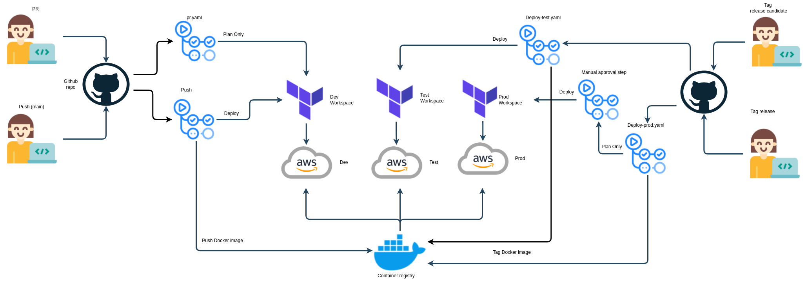

# Sample Startup Project

[](https://github.com/bcgov/repomountie/blob/master/doc/lifecycle-badges.md).

## WIP Warning

It's essentially a fancier "Hello World" app. This demo app is current WIP and not to be considered a reference architecture yet. The Cloud Pathfinder team intends to provide a proper CI/CD pattern and clean up rough edges. For now it has been used internally for testing purposes. Stay tuned we intend to have this improved soon.

---

## Introduction

Welcome to your new project. This is a basic starter project with a NodeJS app connected to a database for you to modify and expand to fit your needs. It provides scripts for developing and running locally, as well as "Infrastructure-as-Code" using Terraform/Terragrunt to allow the app to be easily deployed to public cloud environments. Currently, AWS is supported, but support for other cloud targets may be added in the future.

## Prerequisites

In order to develop or run the app locally, you will need:
- [Docker](https://docs.docker.com/get-docker/)
- [Microsoft Visual Studio Code](https://code.visualstudio.com/)

### Launch DevContainer
1. Open cloned repository in Visual Studio Code
2. Using the Command Palette (Windows: `Ctrl+Shift+P` | Mac: `⇧ ⌘ P`), enter the command: `Reopen in Container`
3. Once open, use Open and Build in Devcontainer
3. Use `docker-compose` commands presented in the next section to build and run local development containers.  


### Build and Run Locally using Docker in Docker

- Builds the local development containers:  
`docker-compose -f docker-compose.dev.yml build`

- Runs the local development containers:  
`docker-compose -f docker-compose.dev.yml up -d`

- Runs the local development containers:  
`docker-compose -f docker-compose.dev.yml up mongodb`

- Closes the local development containers:  
`docker-compose -f docker-compose.dev.yml down`

- Closes the local development containers:  
`docker-compose -f docker-compose.dev.yml restart`

- Tail logs from local development containers:  
`docker-compose -f docker-compose.dev.yml logs -f`

### Other Useful Commands

- `docker exec -it $(PROJECT)-client sh`  
- `docker exec -it $(PROJECT)-server sh`  
- `docker exec -it $(PROJECT)-mongodb bash`  
- `docker exec -it $(PROJECT)-server npm run db:seed`  
- `docker exec -it $(PROJECT)-server npm run db:migration`  
- `docker exec -it $(PROJECT)-server npm test`  


## AWS Credentials

This code assumes that the Terraform Cloud workspaces are pre-populated wth AWS credential environment variables. The workspaces and credentials are automatically created as part of the project provisioning. These credentials are used for creating all resources with terraform.

Additional service account iam users and credentials can be created upon request for performing limited actions like pushing to ECR from a CI/CD. This project uses one of those service accounts to push images to ECR in the sandbox account.

When an additional service account is requested the following values will be provided:

- `AWS_ACCESS_KEY_ID` - credentials for you service account
- `AWS_SECRET_ACCESS_KEY` - credentials for you service account
- `AWS_ROLE_TO_ASSUME` - ARN of the role to assume with your credentials

## AWS Elastic Container Registry (ECR)

This project creates an ECR repository in the sandbox account and authorizes read access from other AWS accounts. This is useful for deploying to ECS.

The GitHub secret `AWS_ACCOUNTS_ECR_READ_ACCESS` is used by the ECR terraform module to authorize the read access from the other AWS accounts.

The following GitHub secret value would allow the dev, test, and prod accounts to read from ECS in the sandbox account:

`AWS_ACCOUNTS_ECR_READ_ACCESS='["arn:aws:iam::DEV_ACCOUNT_NUMBER:root", "arn:aws:iam::TEST_ACCOUNT_NUMBER:root", "arn:aws:iam::PROD_ACCOUNT_NUMBER:root"]'`

A more target approach is possible, it is not necessary to authorize entire accounts.

## GitHub Actions (CI/CD)

### Required Secrets

- `AWS_ACCESS_KEY_ID` - credentials for you service account
- `AWS_SECRET_ACCESS_KEY` - credentials for you service account
- `AWS_ROLE_TO_ASSUME` - ARN of the role to assume with your credentials
- `AWS_ACCOUNTS_ECR_READ_ACCESS` - list of aws principals to grant read access
- `AWS_ECR_URI` - ECR repository URI
- `AWS_REGION` - should be `ca-central-1`
- `TFC_TEAM_TOKEN` - Terraform Cloud team token with access to Terraform workspaces used to deploy the app and infrastructure to AWS.

### Workflows

GitHub Action workflows in `.github/workflows` are used to build, test, and deploy the application. The diagram below illustrates the workflow architecture.



## Cloud Deployment

Terraform and Terragrunt are used to deploy the application to AWS.

### Terraform App Module

The infrastructure for the app is defined in the terraform module linked below and instantiated using Terragrunt (config is in the `terraform/` folder).

[startup-sample-project-terraform-modules](https://github.com/bcgov/startup-sample-project-terraform-modules)

## License

```text
Copyright 2020 Province of British Columbia

Licensed under the Apache License, Version 2.0 (the "License");
you may not use this file except in compliance with the License.
You may obtain a copy of the License at

<http://www.apache.org/licenses/LICENSE-2.0>

Unless required by applicable law or agreed to in writing, software
distributed under the License is distributed on an "AS IS" BASIS,
WITHOUT WARRANTIES OR CONDITIONS OF ANY KIND, either express or implied.
See the License for the specific language governing permissions and
limitations under the License.
```
